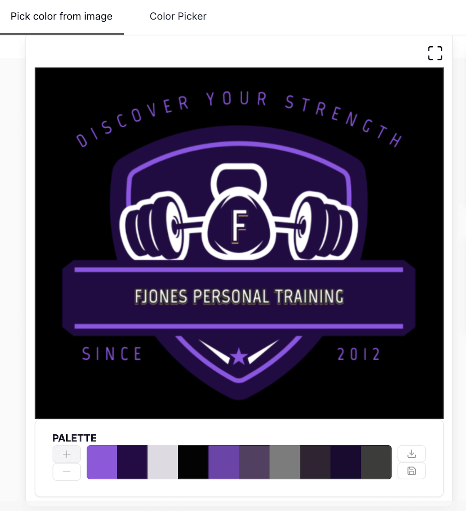

# FJones Personal training

## Introduction

The primary goal of this webpage is to serve as a platform for my friend's business. Currently, my friend does not have a website and relies on word-of-mouth to build his client base. This site aims to offer an engaging and informative introduction to his qualifications, experience, and training philosophy. It will also provide details about one-on-one training sessions, group training, nutritional guidance and customised workout plans. Additionally, the webpage will feature a booking system and accessible contact options, making it easy for potential clients to reach out, ask questions, and schedule consultations.

## CONTENTS
[User Experience]
[User Stories]

## User Experience (UX)

### User Stories

#### First Time Visitor Goals

* I want to be able to learn about the personal trainers qualifications and experience so that i can assess their expertise and find the right trainer for me.
* I want to view testimonials to gauge the effectiveness of the personal trainer.
* I want to see a list of availiable services and pricing to work out my budget.
* I want to be able to view the trainers social media links to learn more about their sessions and training philosophy.
* I want a user-friendly layout so i can find information quickly and is responsive to different screen sizes.

#### Returning Visitor Goals

* Upon returning to the site i would like access to workout and nutrition plans.
* I would like to be able to book a session and contact the trainer.
Frequent Visitor Goals
* I would like to be able to rechedule my bookings online and be able to do this quickly without having to navigate through many pages.
* I want to access a schedule overview to check upcoming sessions at a glace.
* I would like to have access to personalised feedback from sessions.

#### Owner Goals

* To increase the number of new clients and retension of existing clients by offering online services that are accessable to eay to use from any device.
* To increase awareness of his brand by establishing a strong online presence by increasing visibility on search engines that will highlight his experience and qualifications.
* The webpage will make administrive tasks easier by using an automated system that will organise time slots from his clients and make it easier to track payments as currently uses a paper diary to record this.

## Design

### Colour Scheme

I used a colour image picker to select colours from the logo, ensuring consistent colour usage across the webpage. To create visually appealing design, i chose a dark background, accented with purple to highlight specific elements. The use of purple can help reinforce brand identity and can make key components stand out to engage users.

I used the following HEX colours:

#8c5ad9
#240c44
#ffffff
#000000

